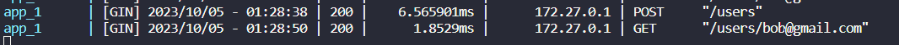
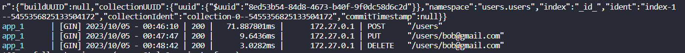
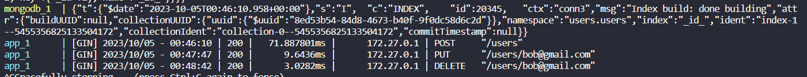

gomongoittalent2023
Stéfano e Jarina

GET e POST

PUT, DELETE

Lista de comandos
  997  2023-10-04 21:41:50 curl -X GET 'http://127.0.0.1:9080/users/bob@gmail.com'
  998  2023-10-04 21:46:10 curl -X POST 'http://127.0.0.1:9080/users' -H "Content-Type: application/json" -d '{"name": "Bob", "email": "bob@gmail.com", "password": "ilovealice"}'
  999  2023-10-04 21:47:47 curl -X PUT 'http://127.0.0.1:9080/users/bob@gmail.com' -H "Content-Type: application/json" -d '{"password": "loveyoualice"}'
 1000  2023-10-04 21:48:42 curl -X DELETE 'http://127.0.0.1:9080/users/bob@gmail.com'
1019  2023-10-04 21:02:53 docker exec -it go-mongo-crud-rest-api_mongodb_1 bash
 1020  2023-10-04 21:05:20 docker-compose down
 1021  2023-10-04 21:05:27 docker-compose up -d
 1022  2023-10-04 21:05:35 docker exec -it go-mongo-crud-rest-api_mongodb_1 bash
 1023  2023-10-04 21:08:58 docker-compose down
 1024  2023-10-04 21:09:02 docker-compose up -d
 1025  2023-10-04 21:18:58 docker-compose down
 1026  2023-10-04 21:19:06 docker-compose up -d
 1027  2023-10-04 21:20:45 docker-compose up 
 1028  2023-10-04 21:22:11 docker-compose up -d
 1029  2023-10-04 21:28:07 docker-compose down
 1030  2023-10-04 21:28:19 docker-compose up -d
 1031  2023-10-04 21:36:36 docker-compose down
 1032  2023-10-04 21:36:59 docker-compose up -d
 1033  2023-10-04 21:37:41 docker exec -it go-mongo-crud-rest-api_mongodb_1 bash
 1034  2023-10-04 21:41:10 docker-compose down
 1035  2023-10-04 21:41:14 docker-compose up 
 1036  2023-10-04 22:12:32 history